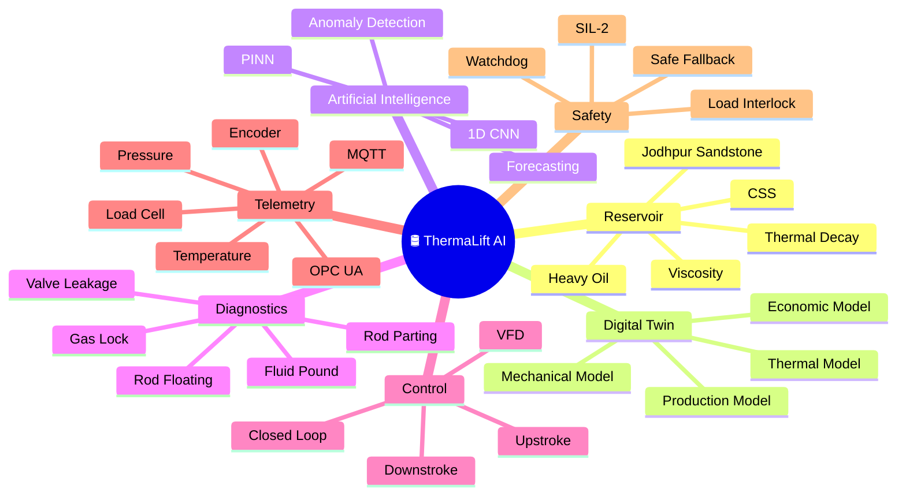
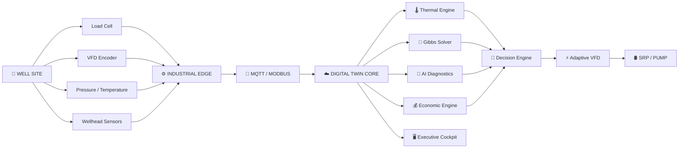
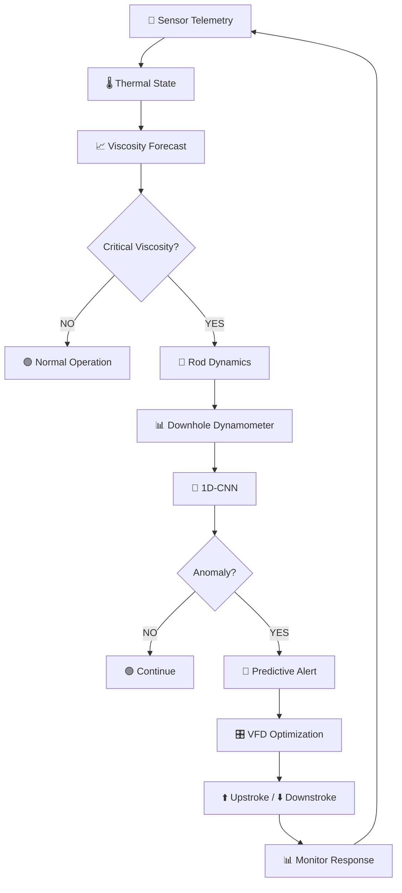
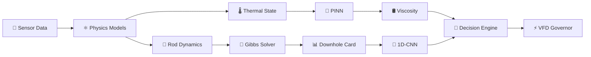
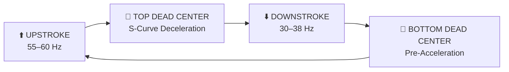
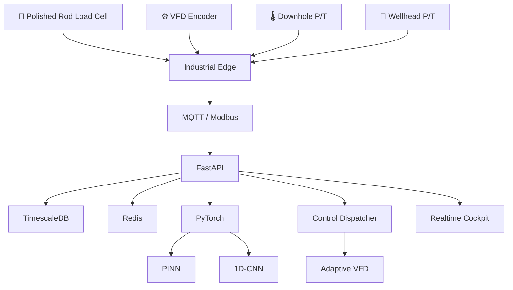

<div align="center">

<!-- ========================= HERO ========================= -->


<br>


<br><br>

<a href="https://thermaliftai.vercel.app/">

</a>

<a href="https://www.youtube.com/watch?v=mCxYFCepW6E">

</a>

<a href="https://drive.google.com/file/d/1o4O2vdlLwOTV7i9YH4qYA00YrnxKNb7P/view?usp=sharing">

</a>

<br><br>


<br><br>


<br><br>

> **A physics + AI driven digital twin for optimizing thermal recovery, sucker-rod dynamics and pumping operations in heavy-oil wells.**

<br>


</div>

---

# 🛢️ What is ThermaLift AI?

**ThermaLift AI** is a well-to-surface digital twin designed around the heavy-oil production challenge at the **Baghewala Heavy Oil Field**.

It connects four major layers:

```text
🌡️ THERMAL STATE
       ↓
🛢️ OIL VISCOSITY
       ↓
🦾 ROD / PUMP DYNAMICS
       ↓
🤖 AI DIAGNOSTICS
       ↓
⚙️ VFD OPTIMIZATION
       ↓
📊 PRODUCTION INTELLIGENCE
````

Instead of treating reservoir temperature, oil viscosity, rod dynamics and pumping control as separate problems, ThermaLift AI models them as one connected operational system.

---

# 🏆 Smart India Hackathon 2026

<div align="center">

### 🇮🇳 Smart India Hackathon 2026 · SuperNovaZ

|                          |                                                                       |
| ------------------------ | --------------------------------------------------------------------- |
| **Problem Statement ID** | `SIH26120`                                                            |
| **Problem Statement**    | Digital Twin for Well-to-Surface Optimization of CSS & SRP Operations |
| **Target Asset**         | Baghewala Heavy Oil Field                                             |
| **Organization**         | Oil India Limited                                                     |
| **Formation**            | Jodhpur Sandstone                                                     |
| **Theme**                | Smart Automation                                                      |
| **Category**             | Software                                                              |
| **Team**                 | SuperNovaZ                                                            |
| **Project**              | ThermaLift AI                                                         |

</div>

---

# 📑 Project Presentation

<div align="center">

<a href="https://drive.google.com/file/d/1o4O2vdlLwOTV7i9YH4qYA00YrnxKNb7P/view?usp=sharing">


</a>

<br><br>

### 📖 Navigate the Presentation

<a href="https://drive.google.com/file/d/1o4O2vdlLwOTV7i9YH4qYA00YrnxKNb7P/view?usp=sharing#page=1">

</a>

  

<a href="https://drive.google.com/file/d/1o4O2vdlLwOTV7i9YH4qYA00YrnxKNb7P/view?usp=sharing#page=2">

</a>

<br><br>

<a href="https://drive.google.com/file/d/1o4O2vdlLwOTV7i9YH4qYA00YrnxKNb7P/view?usp=sharing">

</a>

<br>

<sub>Click the presentation preview or navigation buttons to open the Google Drive document.</sub>

</div>

---

# 🌐 Live Prototype

<div align="center">

<a href="https://thermaliftai.vercel.app/">


</a>

<br><br>

<a href="https://thermaliftai.vercel.app/">

</a>

<br><br>

<sub>Click the dashboard preview to launch the interactive prototype.</sub>

</div>

---

# 🎥 Product Demonstration

<div align="center">

<a href="https://www.youtube.com/watch?v=mCxYFCepW6E">


</a>

<br><br>

<a href="https://www.youtube.com/watch?v=mCxYFCepW6E">

</a>

</div>

---

# ⚡ The Core Problem

Heavy-oil production becomes increasingly difficult as the reservoir cools after thermal stimulation.

```text
              CYCLIC STEAM STIMULATION
                       │
                       ▼
                 🔥 HOT RESERVOIR
                       │
                       ▼
                🛢️ LOW VISCOSITY
                       │
                       ▼
                 ⛽ PRODUCTION
                       │
                       ▼
                🌡️ RESERVOIR COOLS
                       │
                       ▼
               📈 VISCOSITY RISES
                       │
                       ▼
              🦾 ROD DRAG INCREASES
                       │
             ┌─────────┴─────────┐
             ▼                   ▼
       ⚠️ ROD FLOAT         ⚠️ FLUID POUND
             │                   │
             └─────────┬─────────┘
                       ▼
                 💥 MECHANICAL
                    FAILURE
                       │
                       ▼
                 💸 WORKOVER
```

### ThermaLift AI changes the workflow:

```text
REACTIVE
Operator sees failure
       ↓
Manual intervention
       ↓
Production loss
       ↓
Workover

                    ↓↓↓

PREDICTIVE
Thermal forecast
       ↓
Viscosity prediction
       ↓
Rod-dynamics analysis
       ↓
AI anomaly detection
       ↓
Adaptive VFD control
       ↓
Preventive intervention
```

---

# 🔄 Problem → Solution

| Challenge                   | ThermaLift AI                        |
| --------------------------- | ------------------------------------ |
| 🌡️ Reservoir cooling       | Physics-informed thermal forecasting |
| 🛢️ Rising viscosity        | Viscosity-temperature modeling       |
| 🦾 Rod floating             | AI-based anomaly detection           |
| 💥 Fluid pound              | Dynamometer-card analysis            |
| ⚙️ Fixed pumping speed      | Asymmetric VFD modulation            |
| 🧑‍🔧 Reactive intervention | Predictive intervention              |
| 🔥 Inefficient CSS cycle    | Dynamic CSS optimization             |
| 📊 Disconnected data        | Unified digital twin                 |

---

# ✨ Core Capabilities

<div align="center">

| 🌡️ THERMAL        | 🤖 AI             | ⚙️ CONTROL        | 📊 ANALYTICS      |
| ------------------ | ----------------- | ----------------- | ----------------- |
| Reservoir cooling  | 1D-CNN            | Adaptive VFD      | Dynamometer cards |
| Viscosity forecast | PINN              | Stroke modulation | SOR               |
| CSS simulation     | Anomaly detection | Closed-loop logic | Energy            |
| Heat decay         | Prediction        | Safety fallback   | Production        |

</div>

---

# 🧭 Digital Twin Mind Map



---

# 🏗️ System Architecture



---

# 🔄 End-to-End Intelligence Loop



---

# 🧠 Physics + AI Engine

ThermaLift AI combines physics-based modeling with machine learning rather than relying solely on a black-box predictor.



---

# 🌡️ Thermal Forecasting

ThermaLift AI models the thermal decay of the stimulated reservoir.

The documented calibrated temperature formulation is:

$$
T_r(t)=
T_{init}
+
(T_{peak}-T_{init})
e^{-t/\tau_{decay}}
\left[
1-\eta_{loss}
\left(\frac{t}{t_{cycle}}\right)^{0.65}
\right]
$$

The engineering model identifies approximately:

```text
Critical viscosity
      ↓
   ~1,200 cP
      ↓
Temperature
      ↓
  ~67.5°C
```

The goal is to identify the transition toward high-viscosity operating conditions before mechanical problems become severe.

---

# 🦾 Sucker-Rod Dynamics

The rod string is modeled using a damped 1D wave equation:

$$
\frac{\partial^2u}{\partial t^2}
=
a^2
\frac{\partial^2u}{\partial x^2}
-
c(x,t)
\frac{\partial u}{\partial t}
+
g
\left(
1-\frac{\rho_{fluid}}{\rho_{steel}}
\right)
$$

### Model Inputs

```text
Surface Position
      +
Surface Load
      +
Fluid Viscosity
      +
Rod Properties
      +
Well Geometry
      ↓
Gibbs Wave Solver
      ↓
Downhole Pump Dynamics
      ↓
Dynamometer Card
```

---

# 🤖 AI Diagnostic Engine

Dynamometer cards are represented as normalized coordinate pairs:

```text
Input Tensor
(128 × 2)
```

### Neural Pipeline

```text
             ┌─────────────────┐
             │ Dynamometer Card│
             └────────┬────────┘
                      ↓
                Conv1D × 32
                      ↓
                  BatchNorm
                      ↓
                   MaxPool
                      ↓
                Conv1D × 64
                      ↓
                  BatchNorm
                      ↓
                   MaxPool
                      ↓
               Residual Block
                      ↓
             Global Avg Pool
                      ↓
                 Dense 128
                      ↓
                 Softmax
                      ↓
            Condition Confidence
```

### Diagnostic Classes

| Condition           | Detection Concept             |
| ------------------- | ----------------------------- |
| 🟢 Normal Pumping   | Full liquid pump              |
| 🟠 Rod Floating     | Viscous downstroke resistance |
| 🔴 Fluid Pound      | Sudden load drop              |
| 🟡 Gas Interference | Compression curvature         |
| 🔴 Rod Parting      | Near-zero load baseline       |
| 🟠 Valve Leak       | Abnormal stroke profile       |
| 🟠 Pump Unseated    | Abnormal pump card            |

---

# ⚙️ Asymmetric VFD Control

Instead of treating the entire pumping stroke identically, ThermaLift AI divides the motion into control phases.



### Control Strategy

#### ⬆️ Upstroke

* Maximize liquid lifting
* Maintain rod stress limits
* Improve production rate

#### ⬇️ Downstroke

* Reduce velocity
* Compensate for viscous drag
* Reduce rod-floating risk
* Maintain carrier-bar tension

---

# 💰 CSS & Economic Intelligence

ThermaLift AI evaluates the Steam-Oil Ratio:

$$
SOR =
\frac{\text{Steam Injected}}
{\text{Cumulative Oil Recovered}}
$$

and an operating margin:

$$
Net\ Profit =
(q_oP_{oil})
-
(E_{lift}C_{kWh}
+
C_{steam}
+
C_{water}
+
C_{maint})
$$

### Decision Loop

```text
Production Data
      ↓
Oil Recovery
      +
Steam Consumption
      +
Lift Energy
      ↓
SOR + Economic Analysis
      ↓
┌────────────────────────┐
│ Continue CSS / Cut-Off │
└────────────────────────┘
```

---

# 📊 Benchmark Matrix

| Dimension            | Traditional | SCADA     | ThermaLift AI |
| -------------------- | ----------- | --------- | ------------- |
| Thermal Monitoring   | Reactive    | Threshold | Predictive    |
| Viscosity Forecast   | ❌           | ❌         | 🧠 PINN       |
| Downhole Diagnostics | Manual      | Surface   | 🤖 AI + Gibbs |
| Rod-Float Prevention | ❌           | Manual    | ⚙️ Automated  |
| VFD Control          | Fixed       | Static    | 🎛️ Dynamic   |
| CSS Optimization     | Calendar    | Threshold | 💰 Economic   |
| Failure Detection    | Reactive    | Alarm     | 🔮 Predictive |
| Energy Optimization  | Baseline    | Limited   | ⚡ Asymmetric  |

---

# 📡 Industrial Telemetry



---

# 🛠️ Technology Stack

| Layer         | Technology               | Role                   |
| ------------- | ------------------------ | ---------------------- |
| 🧠 AI / ML    | PyTorch 2.2              | PINN + CNN             |
| ⚛️ Physics    | C++ / WebAssembly        | Gibbs solver           |
| 🚀 Backend    | FastAPI / Python 3.11    | API + processing       |
| 🔄 Workers    | Celery                   | Background workloads   |
| 🗄️ Database  | PostgreSQL + TimescaleDB | Time-series data       |
| ⚡ Cache       | Redis                    | Real-time state        |
| 📡 Messaging  | MQTT                     | Telemetry              |
| 🏭 Protocol   | Modbus / OPC-UA          | Industrial integration |
| 🖥️ Frontend  | Web Canvas               | Visualization          |
| 🔌 Realtime   | WebSocket                | Live updates           |
| ☁️ Deployment | Vercel / Cloud           | Application            |
| 🔐 Security   | TLS 1.3 / JWT            | Secure communication   |

---

# 🏭 Target Asset

### Oil India Limited · Baghewala Heavy Oil Field

| Parameter                   | Engineering Model    |
| --------------------------- | -------------------- |
| 🗺️ Basin                   | Bikaner-Nagaur Basin |
| 🪨 Formation                | Jodhpur Sandstone    |
| 🌡️ Reservoir Temperature   | 46–48.5°C            |
| 🛢️ API Gravity             | 17–19.2° API         |
| 🧪 Dead Oil Viscosity       | 18,000–45,000 cP     |
| 🔥 Stimulated Viscosity     | 180–380 cP           |
| 🎯 Critical Float Viscosity | ~1,200 cP            |
| 📍 TVD                      | 1,050–1,200 m        |

These values are part of the project's engineering characterization of the target asset. 

---

# 🔐 Safety Architecture

```text
                 AUTONOMOUS CONTROL
                        │
                        ▼
              ┌───────────────────┐
              │  Control Decision  │
              └─────────┬─────────┘
                        │
             ┌──────────┴──────────┐
             ▼                     ▼
        Software Logic       HARDWARE INTERLOCK
             │                     │
             ▼                     ▼
        VFD Command          Load Protection
             │               Rod Slack Trip
             │                     │
             └──────────┬──────────┘
                        ▼
                  🛑 SAFE STATE
```

### Safety Mechanisms

* 🔴 Independent load protection
* 🧵 Rod-slack emergency interlock
* ⏱️ Communication watchdog
* 🔄 Safe fallback VFD mode
* 🔐 Role-based access
* 🔒 TLS 1.3
* 📋 Immutable audit logging

The technical blueprint specifies hardware interlocks, a communication watchdog, TLS 1.3, JWT-based access control and audit logging. 

---

# 🧪 Operational Test Matrix

| Scenario              | Expected Response         |
| --------------------- | ------------------------- |
| 🟢 Normal Pumping     | Stable operation          |
| 🌡️ Reservoir Cooling | Thermal decline           |
| 📈 Rising Viscosity   | Warning / forecast        |
| 🦾 Rod Floating       | AI classification         |
| 💥 Fluid Pound        | Anomaly detection         |
| 🫧 Gas Interference   | Diagnostic classification |
| 🔴 High Rod Load      | Safety intervention       |
| 📡 Telemetry Loss     | Safe fallback             |
| 💰 High SOR           | CSS optimization          |
| 📉 Low Margin         | Re-steam recommendation   |

---

# 📈 Engineering Targets

```text
┌──────────────────────────────────────┐
│        THERMALIFT AI TARGETS         │
├──────────────────────────────────────┤
│ ⚡ ~24% lifting-energy reduction     │
│ 🔮 Multi-day thermal forecasting     │
│ 📊 100 Hz telemetry / diagnostics    │
│ 🦾 Predictive rod-float prevention   │
│ 🚨 Autonomous anomaly detection      │
│ 💰 Dynamic CSS optimization          │
└──────────────────────────────────────┘
```

The documented benchmark specifies approximately **24.2% lifting-energy savings** and a modeled MTBF above **18.5 months** under the benchmark scenarios described in the project specification. These should be treated as project-model targets/results, not field-validated production measurements. 

---

# 🚀 Roadmap

```text
THERMAL DIGITAL TWIN
│
├── Multi-well simulation
├── Reservoir calibration
├── Production forecasting
└── Automated recalibration

AI
│
├── More anomaly classes
├── Continuous PINN training
├── Explainable diagnostics
└── Advanced control learning

INDUSTRIAL
│
├── SCADA integration
├── OPC-UA deployment
├── Edge GPU acceleration
└── Industrial historian

OPERATIONS
│
├── Multi-well control room
├── Predictive maintenance
├── Production optimization
└── Workover recommendation
```

---

# 🔗 Quick Links

<div align="center">

<a href="https://thermaliftai.vercel.app/">

</a>

<a href="https://www.youtube.com/watch?v=mCxYFCepW6E">

</a>

<a href="https://drive.google.com/file/d/1o4O2vdlLwOTV7i9YH4qYA00YrnxKNb7P/view?usp=sharing">

</a>

</div>

---

# 👨‍💻 Team

<div align="center">

## 🚀 SuperNovaZ

### **ThermaLift AI**

**Smart India Hackathon 2026**

**PS ID: SIH26120**

<br>

> **Synchronised. Predictive. Autonomous.**

</div>

---

<div align="center">


<br>


</div>


