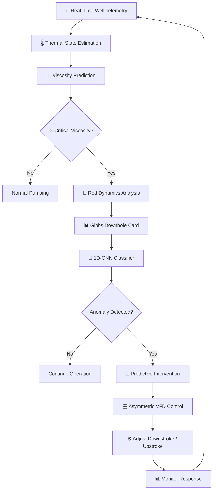
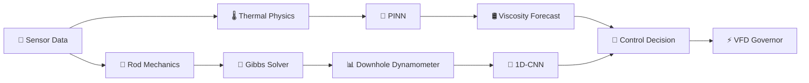
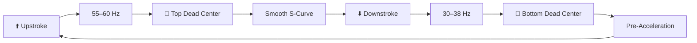
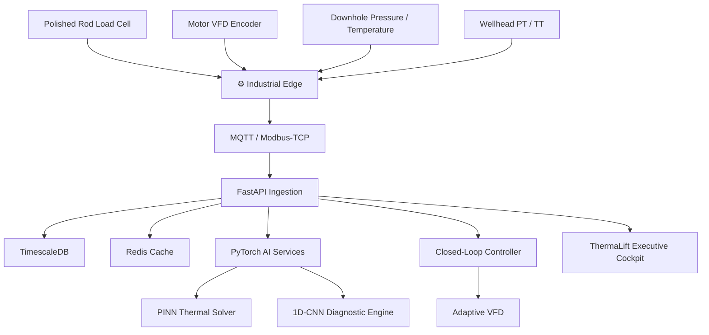

<div align="center">

# 🛢️ ThermaLift AI

### Autonomous Well-to-Surface Digital Twin for Heavy Oil Recovery


<br />

<a href="https://thermaliftai.vercel.app/">
  
</a>

<a href="https://www.youtube.com/watch?v=mCxYFCepW6E">
  
</a>

<br /><br />


<br /><br />

**ThermaLift AI** is an autonomous well-to-surface digital twin designed for heavy-oil production at
**Oil India Limited's Baghewala Heavy Oil Field**.

It couples reservoir thermal forecasting, sucker-rod dynamics, AI-based downhole diagnostics,
and asymmetric VFD control into a single operational intelligence platform.

</div>

---

# 📑 Project Proposal & Solution Showcase

<div align="center">

### 🏆 Smart India Hackathon 2026 · ThermaLift AI

**Problem Statement:** Autonomous Heavy-Oil Production Optimization  
**PS ID:** 26120  
**Target Asset:** OIL Baghewala Heavy Oil Field  
**Formation:** Jodhpur Sandstone · Rajasthan

<br />

<a href="https://drive.google.com/file/d/1o4O2vdlLwOTV7i9YH4qYA00YrnxKNb7P/view?usp=sharing">


</a>

<br /><br />

**[📄 Open Project Presentation](https://drive.google.com/file/d/1o4O2vdlLwOTV7i9YH4qYA00YrnxKNb7P/view?usp=sharing)**

</div>

---

# 🌐 Live Prototype

<div align="center">

<a href="https://thermaliftai.vercel.app/">


</a>

<br />

**🚀 [Open ThermaLift AI](https://thermaliftai.vercel.app/)**

<sub>Click the preview image to open the live digital-twin prototype.</sub>

</div>

---

# 🎥 System Demonstration

<div align="center">

<a href="https://www.youtube.com/watch?v=mCxYFCepW6E">


</a>

<br />

**▶️ Click the thumbnail to watch the ThermaLift AI demonstration**

</div>

---

# 🌐 What Problem Does It Solve?

Heavy-oil production at Baghewala faces a fundamental thermal-mechanical problem.

During **Cyclic Steam Stimulation (CSS)**, injected steam temporarily heats the reservoir and reduces crude viscosity. As the reservoir cools during production, viscosity rises sharply.

This increased viscosity creates significant hydraulic drag on the sucker-rod string, potentially causing:

- Rod floating
- Slow sinker-bar descent
- Fluid pound
- Incomplete pump filling
- Rod-string fatigue
- Sucker-rod parting
- Unplanned workovers

Traditional workflows are largely reactive, with operators responding after surface symptoms appear.

**ThermaLift AI connects thermal behavior, mechanical rod dynamics, AI diagnostics, and pump control into one predictive digital twin.**

### 🔄 Problem → Solution

| Operational Challenge | ThermaLift AI Solution |
|---|---|
| 🌡️ Reservoir cooling | 🧠 Physics-informed thermal forecasting |
| 🛢️ Rising crude viscosity | 📈 Viscosity-temperature prediction |
| 🦾 Rod floating | 🤖 AI anomaly classification |
| 💥 Fluid pound | 📊 Downhole dynamometer reconstruction |
| ⚙️ Fixed pump speed | 🎛️ Asymmetric VFD modulation |
| 🧑‍🔧 Reactive intervention | 🔮 Predictive intervention |
| 💸 High workover cost | 📉 Failure prevention |
| 🔥 Inefficient CSS cycles | 💰 Dynamic economic optimization |

---

# ✨ Core Features

- 🌡️ **Thermal Reservoir Digital Twin**
- 🧠 **Physics-Informed Neural Network (PINN)**
- 📈 **Heavy-Oil Viscosity Forecasting**
- 🦾 **1D Gibbs Wave-Equation Solver**
- 📊 **Downhole Dynamometer Card Reconstruction**
- 🤖 **1D-CNN Rod-Float & Anomaly Classification**
- ⚙️ **Asymmetric Closed-Loop VFD Control**
- 🔥 **CSS Steam-Cycle Simulation**
- 💰 **Steam-Oil Ratio Optimization**
- 🚨 **Predictive Failure Detection**
- 📡 **Real-Time Industrial Telemetry**
- 🔐 **SIL-2 Safety Architecture**
- 🛡️ **Industrial Cybersecurity Controls**
- 📋 **Control Audit Logging**
- ⚡ **Real-Time Executive Operations Cockpit**

---

# 🧭 High-Level Mind Map

```mermaid
mindmap
  root((🛢️ ThermaLift AI))
    Reservoir
      Jodhpur Sandstone
      Heavy Oil
      Thermal Decay
      CSS Cycles
      Viscosity
    Digital Twin
      Thermal Model
      Mechanical Model
      Production Model
      Economic Model
    AI
      PINN
      1D CNN
      Anomaly Detection
      Forecasting
    Diagnostics
      Rod Floating
      Fluid Pound
      Gas Lock
      Rod Parting
      Valve Leakage
    Control
      VFD
      Upstroke Optimization
      Downstroke Deceleration
      Closed Loop Control
    Telemetry
      Load Cell
      Pressure
      Temperature
      Motor Encoder
      MQTT
      OPC UA
    Safety
      SIL-2
      Load Interlock
      Watchdog
      Safe Fallback
    Analytics
      Dynamometer Cards
      Viscosity
      SOR
      Energy
      MTBF
````

---

# 🏗️ System Architecture

### Production Digital-Twin Architecture

```mermaid
flowchart LR

    SENSORS["📡 Wellsite Sensors"]

    SENSORS --> LC["Polished Rod<br/>Load Cell"]
    SENSORS --> VFD["Motor VFD<br/>Encoder"]
    SENSORS --> PT["Downhole<br/>Pressure / Temp"]
    SENSORS --> WH["Wellhead<br/>PT / TT"]

    LC --> EDGE["⚙️ Industrial Edge Runtime"]
    VFD --> EDGE
    PT --> EDGE
    WH --> EDGE

    EDGE --> MQTT["MQTT / Modbus"]
    MQTT --> CLOUD["☁️ Cloud Digital Twin"]

    CLOUD --> THERMAL["🌡️ PINN Thermal Solver"]
    CLOUD --> GIBBS["🦾 Gibbs Wave Solver"]
    CLOUD --> ML["🤖 1D-CNN Diagnostics"]
    CLOUD --> ECON["💰 Economic Optimizer"]

    THERMAL --> CONTROL["🎛️ Control Dispatcher"]
    GIBBS --> CONTROL
    ML --> CONTROL
    ECON --> CONTROL

    CONTROL --> VFDCTRL["⚡ Adaptive VFD Scheduler"]

    VFDCTRL --> PUMP["🛢️ Pumping Unit"]

    CLOUD --> UI["🖥️ ThermaLift AI Cockpit"]
```

---

# 🔄 End-to-End AI Workflow



---

# 🧠 AI & Physics Engine

ThermaLift AI does not rely on a single black-box prediction model.

It combines **physics-based equations with machine learning**.



---

# 🌡️ Thermal Forecasting

ThermaLift AI models reservoir thermal decay after steam stimulation.

The calibrated reservoir temperature formulation is:

$$
T_r(t) =
T_{init}
+
(T_{peak}-T_{init})
\cdot
e^{-t/\tau_{decay}}
\cdot
\left[
1-\eta_{loss}
\left(\frac{t}{t_{cycle}}\right)^{0.65}
\right]
$$

The system uses predicted thermal decline to estimate when heavy crude viscosity approaches the critical rod-float region.

For the Baghewala model, the documented critical viscosity is approximately:

**1,200 cP at ~67.5°C**

This allows the system to act before mechanical degradation becomes severe.

---

# 🦾 Sucker-Rod Dynamics

ThermaLift AI reconstructs downhole rod behavior using the 1D damped wave equation:

$$
\frac{\partial^2u}{\partial t^2}
=
a^2
\frac{\partial^2u}{\partial x^2}
-
c(x,t)
\frac{\partial u}{\partial t}
+
g
\left(
1-\frac{\rho_{fluid}}{\rho_{steel}}
\right)
$$

Where:

* `u(x,t)` = axial rod displacement
* `a` = stress-wave velocity
* `c(x,t)` = viscosity-dependent damping
* `g` = gravitational acceleration
* `μ(T)` = temperature-dependent crude viscosity

The solver converts surface telemetry into a simulated downhole dynamometer card.

---

# 🤖 1D-CNN Diagnostic Engine

Surface and downhole dynamometer cards are normalized into:

```text
Input Shape
(128, 2)
```

The classification pipeline:

```text
Input Card Tensor
       │
       ▼
Conv1D
32 Filters
       │
       ▼
BatchNorm
       │
       ▼
MaxPool
       │
       ▼
Conv1D
64 Filters
       │
       ▼
BatchNorm
       │
       ▼
MaxPool
       │
       ▼
Residual Block
128 Filters
       │
       ▼
Global Average Pooling
       │
       ▼
Dense Layer
       │
       ▼
Softmax
       │
       ▼
Condition Confidence
```

### Diagnostic Conditions

| Condition           | Diagnostic Signal            |
| ------------------- | ---------------------------- |
| 🟢 Normal Pumping   | Full liquid pump             |
| 🟠 Rod Floating     | High viscous downstroke drag |
| 🔴 Fluid Pound      | Sudden load drop             |
| 🟡 Gas Interference | Compression curvature        |
| 🔴 Rod Parting      | Near-zero load baseline      |
| 🟠 Valve Leak       | Abnormal stroke shape        |
| 🟠 Pump Unseated    | Abnormal pump card           |

---

# ⚙️ Asymmetric VFD Control

Traditional pumping systems generally operate using a fixed or manually adjusted speed.

ThermaLift AI dynamically changes motor frequency during different portions of the pumping stroke.



### Control Objective

**Upstroke**

* Maximize liquid lifting
* Maintain rod stress within limits
* Improve production rate

**Downstroke**

* Reduce velocity
* Compensate for viscous drag
* Prevent rod floating
* Maintain rod tension

---

# 💰 CSS & Economic Optimization

ThermaLift AI continuously evaluates Steam-Oil Ratio:

$$
SOR =
\frac{\text{CWE Volume of Steam Injected}}
{\text{Cumulative Oil Recovered}}
$$

The system also evaluates:

$$
Net\ Profit =
(q_o \times P_{oil})
-
(E_{lift}C_{kWh}
+
C_{steam}
+
C_{water}
+
C_{maint})
$$

If economic performance falls below the configured threshold, the platform generates an:

> **Optimal CSS Cycle Cut-Off & Re-Steam Notification**

---

# 📊 Comparative Benchmark

| Evaluation Dimension | Traditional Workflow | SCADA                | ThermaLift AI      |
| -------------------- | -------------------- | -------------------- | ------------------ |
| Thermal Monitoring   | Reactive             | Threshold-based      | Predictive         |
| Viscosity Forecast   | ❌                    | ❌                    | ✅ PINN             |
| Downhole Diagnostics | Manual               | Surface-only         | AI + Gibbs Solver  |
| Rod-Float Prevention | ❌                    | Manual               | Closed-loop        |
| VFD Control          | Fixed / Manual       | Static               | Dynamic            |
| CSS Optimization     | Calendar-based       | Production threshold | Economic + SOR     |
| Failure Detection    | Reactive             | Alarm-based          | Predictive         |
| Energy Optimization  | Baseline             | Limited              | Asymmetric control |

---

# 📡 Industrial Telemetry Architecture



---

# 🛠️ Technology Stack

| Layer               | Technology                  | Purpose                 |
| ------------------- | --------------------------- | ----------------------- |
| AI / ML             | PyTorch 2.2                 | CNN + PINN models       |
| Physics Engine      | C++ / WebAssembly           | Real-time Gibbs solver  |
| Backend             | Python 3.11 + FastAPI       | API & processing        |
| Task Processing     | Celery                      | Distributed workloads   |
| Database            | PostgreSQL 16 + TimescaleDB | Time-series telemetry   |
| Cache               | Redis                       | Real-time data          |
| Messaging           | MQTT                        | Industrial telemetry    |
| Industrial Protocol | Modbus / OPC-UA             | Edge communication      |
| Frontend            | Web Canvas                  | Real-time visualization |
| Realtime            | WebSocket                   | Live telemetry          |
| Deployment          | Vercel / Cloud              | Web application         |
| Security            | TLS 1.3 / JWT               | Secure communication    |

---

# 🏭 Target Asset

### Oil India Limited · Baghewala Heavy Oil Field

| Parameter                   | Model Value          |
| --------------------------- | -------------------- |
| 🗺️ Basin                   | Bikaner-Nagaur Basin |
| 🪨 Formation                | Jodhpur Sandstone    |
| 🌡️ Reservoir Temperature   | 46–48.5°C            |
| 🛢️ Crude API               | 17–19.2° API         |
| 🧪 Dead Oil Viscosity       | 18,000–45,000 cP     |
| 🔥 Stimulated Viscosity     | 180–380 cP           |
| 🎯 Critical Float Viscosity | ~1,200 cP            |
| 📍 TVD                      | 1,050–1,200 m        |

These parameters form the engineering basis of the Baghewala digital-twin model. 

---

# 🔐 Safety & Cybersecurity

ThermaLift AI incorporates independent safety mechanisms around the autonomous control loop.

### Hardware Safety

* 🔴 Independent over-load interlock
* ⚡ Maximum-load protection
* 🧵 Rod-slack emergency interlock
* 🛑 Software-independent shutdown

### Communication Safety

* 📡 MQTT / OPC-UA heartbeat monitoring
* ⏱️ Communication watchdog
* 🔄 Safe fallback VFD mode

### Cybersecurity

* 🔐 Role-Based Access Control
* 🔑 Signed JWT authentication
* 🔒 TLS 1.3 encrypted communication
* 📋 Immutable control audit logs

The technical specification defines a SIL-2-oriented safety architecture and a 5-second communication watchdog fallback. 

---

# 🧪 Operational Test Scenarios

| Test                | Expected System Behavior    |
| ------------------- | --------------------------- |
| Normal pumping      | Stable operation            |
| Reservoir cooling   | Thermal decline detected    |
| Rising viscosity    | Viscosity warning generated |
| Rod floating        | AI anomaly classification   |
| Fluid pound         | Early anomaly detection     |
| Gas interference    | Diagnostic classification   |
| High rod load       | Safety intervention         |
| Telemetry loss      | Safe VFD fallback           |
| High SOR            | CSS optimization alert      |
| Low economic margin | Re-steam recommendation     |

---

# 📈 Key Engineering Targets

According to the project specification, the target performance improvements include:

```text
⚡ Up to ~24% lifting energy reduction
🛢️ Dynamic CSS optimization
🦾 Predictive rod-float prevention
📊 100 Hz telemetry / diagnostics
🔮 Multi-day thermal forecasting
🚨 Autonomous anomaly detection
```

The documented benchmark specifies approximately **24.2% lifting-energy savings** and a modeled MTBF target exceeding **18.5 months**, compared against the benchmark scenarios defined in the technical specification. 

---

# 🚀 Roadmap

```text
Digital Twin
├── Multi-well digital twin
├── Improved reservoir calibration
├── Real-time production forecasting
└── Automated model recalibration

AI
├── More anomaly classes
├── Continuous PINN training
├── Reinforcement learning control
└── Explainable AI diagnostics

Industrial Integration
├── SCADA integration
├── OPC-UA deployment
├── Edge GPU acceleration
└── Industrial historian integration

Operations
├── Multi-well control room
├── Predictive maintenance
├── Production optimization
└── Automated workover recommendations
```

---

# 🏆 Smart India Hackathon Context

* **Problem Statement:** Autonomous Heavy-Oil Production Optimization
* **PS ID:** **26120**
* **Target Organization:** **Oil India Limited**
* **Target Asset:** **Baghewala Heavy Oil Field**
* **Formation:** **Jodhpur Sandstone**
* **Category:** Software
* **Project:** **ThermaLift AI**

The technical specification identifies PS ID **26120** and the Baghewala Heavy Oil Field as the target problem context. 

---

# 👨‍💻 Author

<div align="center">

### **Avin Raj**

Computer Science & Engineering

Built as part of the **Smart India Hackathon 2026** project.

<br />

⭐ If you find **ThermaLift AI** interesting, consider starring the repository.

</div>

---

<div align="center">

# 🛢️ ThermaLift AI

### **Predict the heat. Diagnose the rod. Optimize the lift.**


</div>


